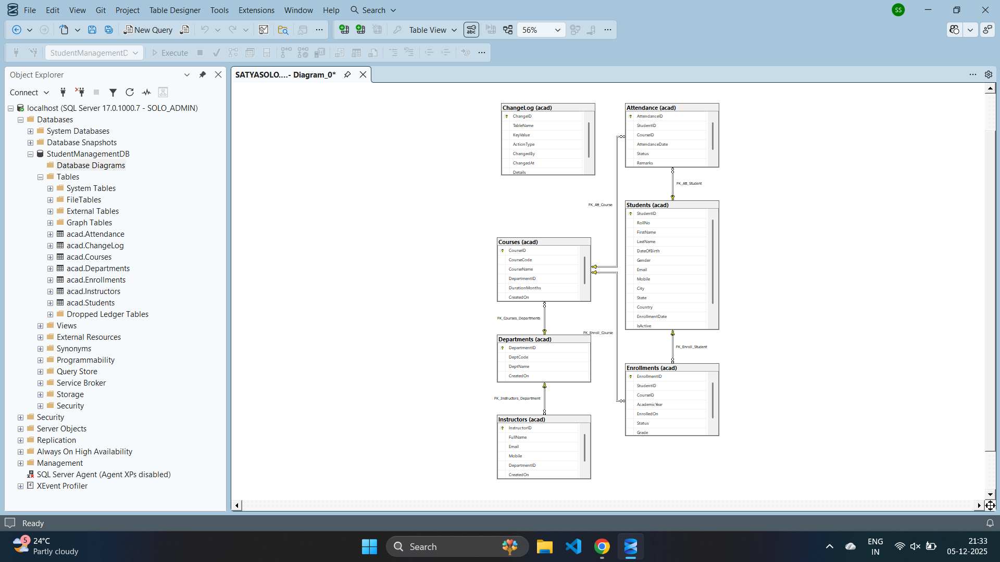
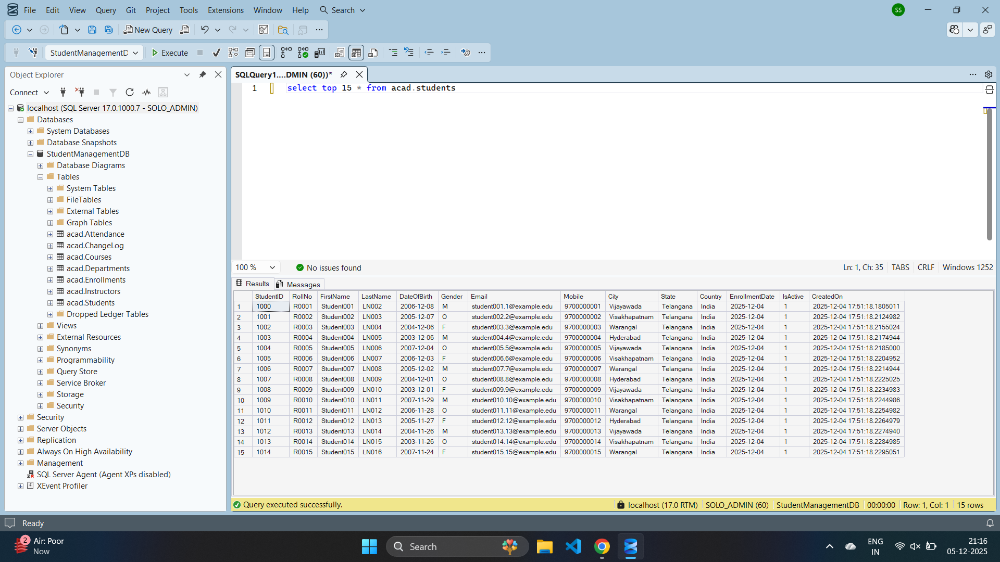
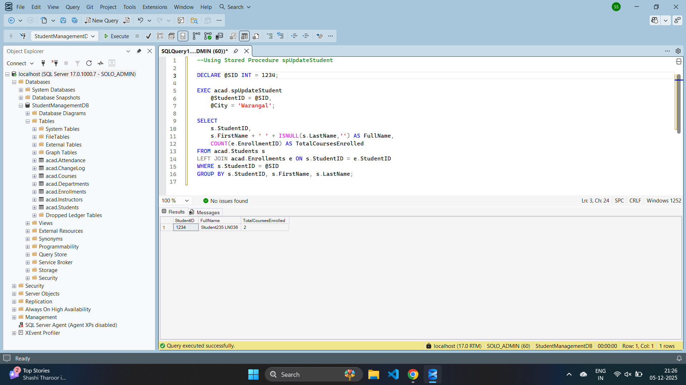
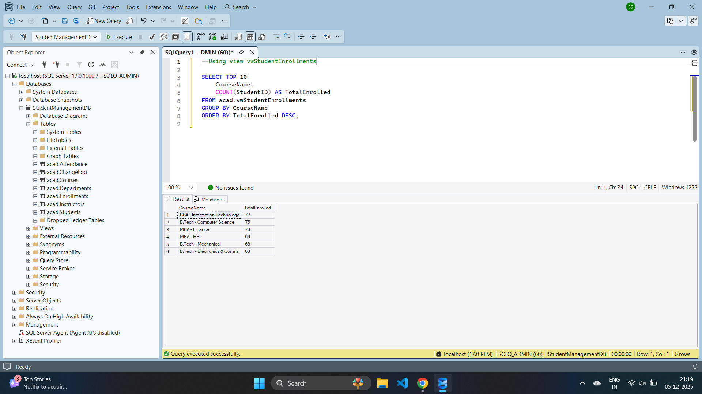
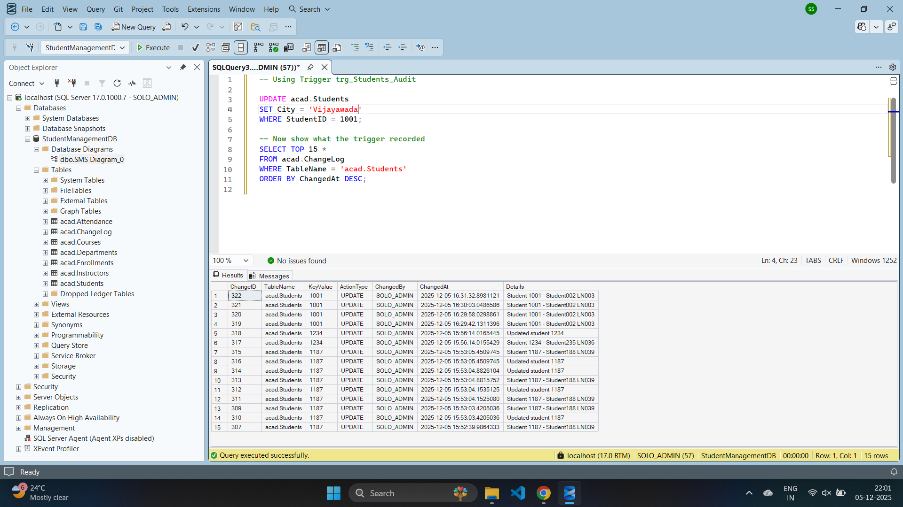
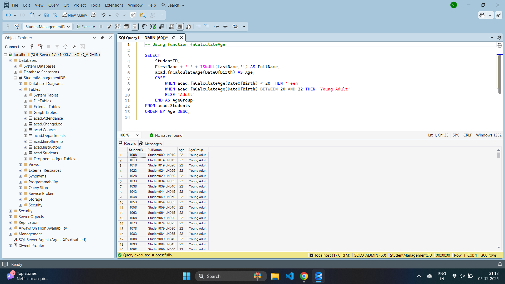

🎓 Student Management System (SMS) – SQL Server Project

This is my first complete SQL project, built to understand real-world database design and SQL Server development.
The project is fully implemented using a single SQL script (SMS.sql), which creates:

Database & schema

All tables with constraints

Stored Procedures

Views

Scalar Functions

Trigger-based audit logging

300 sample student records + enrollments + attendance

ER Diagram & output screenshots

This project is designed so anyone can run it instantly in SSMS and explore a complete relational system.

🚀 Features Included
🗃️ 1. Database Schema (acad schema)

The script creates a full academic system with the following tables:

Departments

Courses

Students

Enrollments

Attendance

Instructors

ChangeLog (for auditing)

All tables include:

Primary Keys

Foreign Keys

Constraints

Indexes

Defaults

Proper relationships (PK–FK)

⚙️ 2. Stored Procedures

Reusable business logic for consistent operations:

Procedure	Purpose
spAddStudent	Inserts a new student & logs the action
spEnrollStudent	Enrolls a student with validation
spUpdateStudent	Updates student details safely
👁️ 3. View
View Name	Description
vwStudentEnrollments	Combines student, course, and department details for reporting

This simplifies analytics and avoids repetitive JOINs.

🧮 4. Scalar Function
Function	Purpose
fnCalculateAge	Calculates age from date of birth (accurately handles month/day)

Used in reports and dashboards.

🔥 5. Trigger
Trigger	Purpose
trg_Students_Audit	Automatically logs INSERT / UPDATE actions to the ChangeLog table

This shows how enterprise auditing works.

📊 6. Sample Data Generation

The script auto-generates:

300 students

Random enrollments (1–2 per student)

200 attendance rows

Full audit logs

This makes the database immediately usable for demos and practice.

🛠️ How to Run This Project
✔ Step 1: Open SSMS
✔ Step 2: Open the file

StudentManagementDB_Full.sql

✔ Step 3: Run the entire script (F5)

The script will:

Drop the database if it exists

Create a fresh one

Build schema, tables, views, procedures, triggers

Insert sample data

Show example queries

You now have a fully working Student Management System database.

🧩 ER Diagram

Visual representation of relationships:

🧪 Sample Queries & Screenshots
🎯 Students Output

⚙️ Stored Procedure Execution

👁️ View Results

🔥 Trigger Logging

🧮 Function Usage

📂 Project Structure
StudentManagementSystem-SQL/
│
├── StudentManagementDB_Full.sql   # Full database installer script
├── README.md                      # Project documentation
└── Outputs/                        # Images & ERD for documentation
      ├── SMS ER diagram.png
      ├── SMS Students.png
      ├── SMS SP.png
      ├── SMS view.png
      ├── SMS Trigger.png
      └── SMS Function.png

🎓 What I Learned

Designing normalized relational databases

Implementing PK/FK constraints

Writing Stored Procedures

Designing Views for analytics

Building custom Functions

Implementing Triggers for auditing

Automating sample data generation

Writing professional SQL documentation

Creating GitHub-ready projects

⭐ If you like this project

Please ⭐ Star the repository and feel free to share feedback!

🤝 Connect With Me

If you'd like to collaborate or discuss SQL/data projects—I'm always open to learning more.
